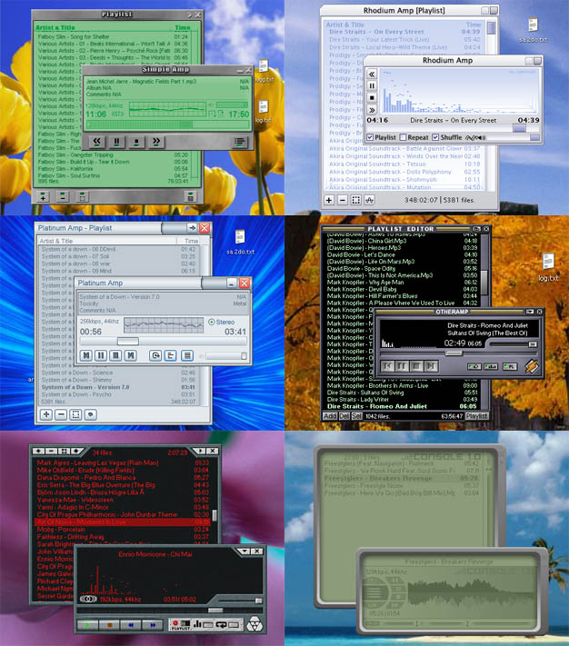



## Simple Amp 2\.0

### Description

----

NOTE: Mp3Tagger requires some .dll and .ocx

files, which may have been removed from these

files. Visit my webpage at http://pab.dyndns.org

to download Simple Amp 2 with these files included!

----

This is the newest version of Simple Amp. In my opinion Simple Amp is much better than Winamp2, just take a look at some of the features: Supports playing of Mp3, Mp2, Ogg, Wma, Asf, Mod, It, S3m, Xm, Midi, CD Audio and opening playlist files. Media Library keeps track of your media files. Many different visualizations. 'Sound Studio' lets you change how the music sounds via an equalizer, several effects (for example Chorus, Reverb, Echo, Distortion) and pitch control. Seven skins. And much more...
 
### More Info
 

             |
---                |---
**Submitted On**   |2003-12-26 19:38:18
**By**             |[Paul Berlin](https://github.com/Planet-Source-Code/PSCIndex/blob/master/ByAuthor/paul-berlin.md)
**Level**          |Advanced
**User Rating**    |4.6 (96 globes from 21 users)
**Compatibility**  |VB 6\.0
**Category**       |[Sound/MP3](https://github.com/Planet-Source-Code/PSCIndex/blob/master/ByCategory/sound-mp3__1-45.md)
**World**          |[Visual Basic](https://github.com/Planet-Source-Code/PSCIndex/blob/master/ByWorld/visual-basic.md)
**Archive File**   |[Simple\_Amp171695362004\.zip](https://github.com/Planet-Source-Code/paul-berlin-simple-amp-2-0__1-52186/archive/master.zip)

